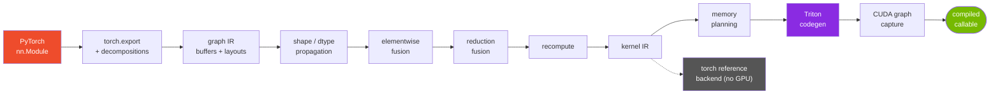

<div align="center">

# mlc

**An ahead-of-time compiler for static-shape PyTorch inference.**

Captures a model with `torch.export`, lowers it to its own graph IR, fuses
elementwise and reduction chains into single Triton kernels, packs every
intermediate into one memory arena, and replays the whole schedule as a CUDA graph.

[](../../actions/workflows/tests.yml)


**5.5x faster than eager · 3.0x faster than `torch.compile`** at batch size 1 on BERT-base
<br>*and it loses to `torch.compile` by batch 8, which is the interesting part*

</div>

---

## The question

PyTorch eager runs one operator at a time, so every intermediate round-trips
through HBM and every op pays a kernel launch. `torch.compile` fixes a lot of
that, but it has to stay general.

**What does specializing all the way to static-shape inference actually buy,
and where does it stop paying?** Fixing shapes and dropping training lets a
compiler plan memory across the whole graph and freeze the entire schedule
into a replayable CUDA graph. This measures how much that is worth.

The answer, up front: **a great deal at batch size 1, and nothing by batch 8.**

## Results

BERT-base and GPT-2 small, fp16, sequence 128, on an NVIDIA A40.
Every variant is checked against eager before it is timed.

| model | batch | eager | `torch.compile` | **mlc** | vs eager | vs `torch.compile` |
|---|---:|---:|---:|---:|---:|---:|
| bert-base | 1 | 5.91 ms | 3.30 ms | **1.08 ms** | 5.48x | **3.05x** |
| bert-base | 8 | 5.10 ms | 3.44 ms | 3.74 ms | 1.37x | 0.92x |
| bert-base | 32 | 16.00 ms | 11.74 ms | 13.83 ms | 1.16x | 0.85x |
| gpt2-small | 1 | 5.40 ms | 2.49 ms | **1.14 ms** | 4.73x | **2.19x** |
| gpt2-small | 8 | 8.16 ms | 4.74 ms | 5.34 ms | 1.53x | 0.89x |
| gpt2-small | 32 | 21.52 ms | 14.33 ms | 20.30 ms | 1.06x | 0.71x |

The clearest evidence for *why* batch 1 is special is in the baseline itself:
**eager is faster at batch 8 (5.10 ms) than at batch 1 (5.91 ms).** Eight times
the work in less time means batch 1 is not doing work, it is paying for
launches. That is the regime this design targets, and it is also why the
advantage disappears the moment there is real work per kernel.

Peak memory goes the other way and **improves with batch size**, because it is
the one advantage that does not depend on launch overhead:

| model | batch | eager | `torch.compile` | **mlc** | saved vs `t.c` |
|---|---:|---:|---:|---:|---:|
| bert-base | 32 | 292 MB | 346 MB | **292 MB** | 16% |
| gpt2-small | 8 | 629 MB | 627 MB | **545 MB** | 13% |
| gpt2-small | 32 | 1522 MB | 1593 MB | **1183 MB** | **26%** |

Full tables, every variant, and per-pass attribution: **[results/RESULTS.md](results/RESULTS.md)**

## Quickstart

```bash
git clone https://github.com/mohamadmsalman82/mlc-compiler && cd mlc-compiler
pip install torch pytest numpy          # Triton ships with torch on Linux
pytest tests/                           # 578 tests, no GPU needed
```

```python
import torch, mlc

model = MyModel().eval().cuda()
example = (torch.randn(1, 128, 768, device="cuda"),)

compiled = mlc.compile(model, example)   # valid for these shapes only
out = compiled(*example)

print(compiled.schedule.format())        # the kernel list
print(compiled.source())                 # the generated Triton
```

Every pass has a flag, so its contribution can be measured on its own:

```python
from mlc import Config
mlc.compile(model, example, Config(reduction_fusion=False))
```

## Architecture



| stage | module | what it does |
|---|---|---|
| capture | `mlc/ir/capture.py` | `torch.export` plus a decomposition table that forces softmax, layer norm and gelu apart so their structure is visible |
| types | `mlc/ir/shapes.py` | shape, dtype and layout propagation, cross-checked against the exporter in tests |
| elementwise fusion | `mlc/passes/fusion.py` | maximal chains over one iteration space, plus recompute for multi-consumer producers |
| reduction fusion | `mlc/passes/reduction_fusion.py` | persistent kernels, one row per thread block, both fusion directions |
| memory planning | `mlc/passes/memory_planning.py` | live ranges packed into one arena by interval-graph colouring |
| codegen | `mlc/codegen/triton_backend.py` | one `@triton.jit` per kernel plus a launch table |
| runtime | `mlc/runtime/executor.py` | flat buffers, extern dispatch, pre-resolved launch plan, CUDA graph capture |

## What it compiles to

`python -m mlc passes bert-base --batch 1 --seq 128`:

| pass enabled | kernels | pointwise | reduction | extern | intermediates |
|---|---:|---:|---:|---:|---:|
| no passes | 730 | 556 | 0 | 174 | 331 MB |
| elementwise | 323 | 149 | 0 | 174 | 140 MB |
| + reduction | 200 | 63 | 37 | 100 | 112 MB |
| + memory planning | 200 | 63 | 37 | 100 | **3.4 MB** |

**1229 graph nodes become 200 kernels**, 100 of which are the matmuls and
embeddings that dispatch to cuBLAS.

Softmax compiles to a single kernel: the scale, the causal mask, both
reductions and the divide, with the mask folded into index arithmetic.

```python
@triton.jit
def k6(in_ptr0, in_ptr1, out_ptr0, BLOCK_COL: tl.constexpr):
    # persistent: 512 rows of 64, row space [1, 8, 64], reduced [64]
    row = tl.program_id(0)
    col = tl.arange(0, BLOCK_COL)
    # 64 is exactly BLOCK_COL: no column mask needed
    v0 = tl.load(in_ptr0 + ((row * 64 + col)))              # scores
    v1 = tl.load(in_ptr1 + (((row % 64) * 256 + col)))      # causal mask
    t0 = (v0 / 8.0)
    t1 = (t0 + v1)
    r2 = tl.max(t1, axis=0)
    t3 = (t1 - r2)
    t4 = tl.exp(t3)
    r5 = tl.sum(t4, axis=0)
    t6 = (t4 / r5)
    tl.store(out_ptr0 + ((row * 64 + col)), t6)             # probs
```

Layer norm is the same shape and picks up the residual add and the bias
before it as producers, and the affine transform after it as an epilogue.

## Two ideas that do most of the work

<details>
<summary><b>Views are free, so fusion sees through every reshape</b></summary>

<br>

A `Buffer` is storage. A `Layout` is a (shape, strides, offset) view of it.
`view`, `permute`, `expand`, `slice` and `as_strided` all produce a new layout
over the same buffer and generate no code at all.

`Layout.reshape` uses torch's contiguous-run algorithm rather than requiring
full contiguity, so the qkv split in an attention block stays free instead of
forcing three copies per layer. It is differentially tested against
`torch.Tensor.view` on every layout the test suite can enumerate.

</details>

<details>
<summary><b>Index maps are canonical, which makes register reuse decidable</b></summary>

<br>

Each operand carries an affine map from the kernel's iteration variables to a
buffer offset, simplified by dropping size-1 dimensions, merging contiguous
ones, and dropping stride-0 ones.

Two operands with equal maps touch the same address at the same iteration.
That is how the compiler decides a read can be a register reference instead of
a load, and because the form is canonical it sees through reshapes: `[B*T, D]`
and `[B, T, D]` views of a contiguous buffer both reduce to `idx`, so fusion
crosses every reshape a transformer contains. A *transposed* view reduces to
`(idx // 4) + (idx % 4) * 8`, does not compare equal, and correctly falls back
to a load.

```
contiguous       -> idx
bias broadcast   -> (idx % 64)
row statistic    -> (idx // 64)
transposed       -> ((idx // 4) + (idx % 4) * 8)
qkv slice        -> ((idx // 64) * 192 + (idx % 64) + 64)
```

</details>

## Where it stops paying

At batch 32 `torch.compile` is 15% ahead on BERT and 41% ahead on GPT-2. The
[full analysis](docs/where-torch-compile-wins.md) is a separate document, but
the short version:

First, the baseline is not handicapped. `torch.compile` takes the model with
**zero graph breaks**, and its `reduce-overhead` mode genuinely records
cudagraph trees.

At batch 32 the matmuls are **63% of the runtime and are the same cuBLAS calls
in both compilers**, so the entire 2.3 ms gap comes out of the third we
generate ourselves:

| | generated launches | distinct kernels | extern calls |
|---|---:|---:|---:|
| mlc | 136 | 136 | 100 |
| Inductor | 41 | 6 | 73 |

**Inductor emits no copy kernels. We emit 48.** They come from attention:
`q @ k.transpose(-2, -1)` wants its operands in a particular layout, and this
compiler always allocates a kernel's output contiguous in that operation's
natural shape, so a transposed consumer forces a copy. Inductor chooses output
layouts, so the projection writes straight into the layout the matmul wants.

The cost checks out two ways: **measured at 1.22 ms of 14.26 ms**, and
**1.08 ms from first principles** (576 MB of traffic at the device's measured
561 GB/s). That is roughly half the gap.

It is *not* autotuning, which was the comfortable answer:

| pointwise block | 256 | 512 | 1024 | 2048 | 4096 |
|---|---:|---:|---:|---:|---:|
| ms | 14.21 | 14.26 | **14.09** | 14.11 | 14.28 |

A 16x range of block sizes moves the total by 1.3%.

## Stack

| | |
|---|---|
| **Language** | Python 3.11 / 3.12 |
| **Frontend** | `torch.export`, `torch.fx`, `torch._decomp` |
| **Codegen** | Triton 3.0 (`@triton.jit`, `tl.*`, libdevice) |
| **Extern kernels** | cuBLAS via ATen out-variants |
| **Runtime** | CUDA graphs, flat arena allocation |
| **Measurement** | CUDA events, `torch.cuda.max_memory_allocated`, on-device calibration |
| **Baselines** | PyTorch eager, `torch.compile` (Inductor), `mode="reduce-overhead"` |
| **Testing** | pytest, differential testing against torch, GitHub Actions |
| **Hardware** | NVIDIA A40 (Ampere, 46 GB), CUDA 12.4, driver 570.169 |

## Command line

```bash
python -m mlc graph   gpt2-small                  # the graph IR after capture
python -m mlc passes  bert-base                   # kernel count after each pass
python -m mlc show    bert-base                   # the schedule and memory plan
python -m mlc source  bert-base --kernel k6       # the generated Triton
python -m mlc run     bert-base --device cuda     # compile, run, check vs eager
python -m mlc profile bert-base --batch 32        # per-kernel device time
python -m mlc.bench   --calibrate --dtype float16 # the full sweep
```

## Testing without a GPU

Triton needs CUDA. Most of what can go wrong here does not.

The reference backend in `mlc/codegen/torch_backend.py` executes the same
kernel IR with torch ops, evaluating index expressions **from the same
rendered source string the Triton backend emits**. So operator lowering, index
arithmetic, fusion legality, memory planning and scheduling are all under test
on any machine. Only the Triton mechanics need real hardware.

The streamed reduction path and its online-softmax recurrence are covered by
lowering `max_persistent_row` so that even a 32-element row does not fit.

```
578 tests, ~90 seconds, CPU only
```

| file | tests | covers |
|---|---:|---|
| `test_layout.py` | 68 | layout algebra, differentially against `torch.Tensor.view` |
| `test_capture.py` | 60 | frontend, propagation checked against the exporter |
| `test_fusion.py` | 60 | fusion legality, acyclicity, recompute, register locality |
| `test_reduction_fusion.py` | 80 | both fusion directions, numerics, online softmax |
| `test_memory_planning.py` | 71 | live ranges, packing, aliasing, randomised intervals |
| `test_correctness.py` | 86 | end to end vs eager across every pass configuration |
| `test_codegen.py` | 47 | generated Triton parses, launch table, constant folding |
| `test_devices.py` | 55 | cost-model constants stay physical |
| `test_dtypes.py` | 24 | fp16 accumulation, no upcast matmuls |
| `test_bench_models.py` + `test_bench_reporting.py` | 27 | benchmark models and the reporting path |

## Documentation

| document | what it covers |
|---|---|
| **[WRITEUP.md](WRITEUP.md)** | the full story: design decisions, every bug, what the numbers mean |
| [docs/fusion-legality.md](docs/fusion-legality.md) | every legality rule, what breaks without it, and the cost model |
| [docs/benchmarks.md](docs/benchmarks.md) | benchmark protocol and its caveats, written before the results |
| [docs/where-torch-compile-wins.md](docs/where-torch-compile-wins.md) | the crossover, quantified |
| [results/RESULTS.md](results/RESULTS.md) | every measurement, every variant, per-pass attribution |

## Scope

**In:** static shapes, inference, elementwise and reduction fusion, memory
planning, Triton codegen, CUDA graphs.

**Out:** training, dynamic shapes, autotuning, MLIR, LLVM, custom GEMM,
convolution. Matmuls dispatch to cuBLAS and act as fusion barriers.

```
7100 lines of compiler · 1900 lines of tests · 21 commits
```
